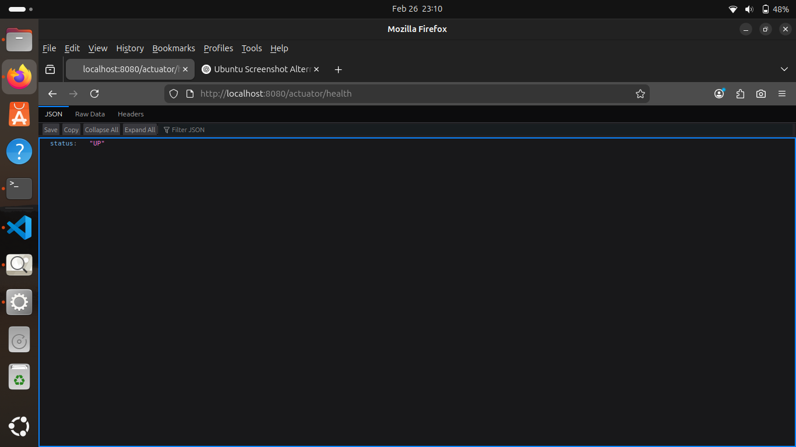
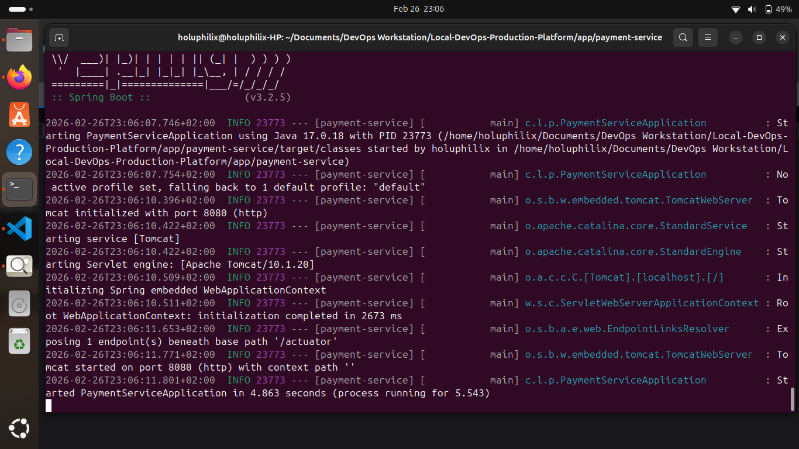
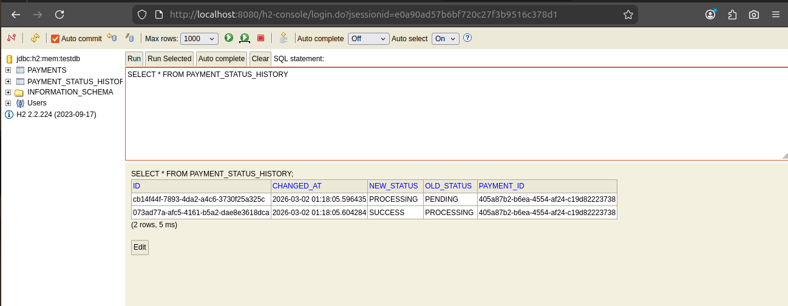

# Local DevOps Production Platform

## 1. Project Overview

The **Local DevOps Production Platform** simulates a production-grade payment processing backend system built using modern DevOps and cloud-native practices.

The platform is designed to:

* Run entirely in a local development environment
* Reflect real-world production architecture patterns
* Demonstrate layered backend design
* Simulate infrastructure automation workflows

The system evolves progressively across development stages:

* H2 in-memory database for local validation
* PostgreSQL for containerized and Kubernetes deployment
* Docker-based containerization
* Multi-container orchestration using Docker Compose
* Kubernetes deployment using Kind
* CI/CD automation using GitHub Actions
* Security scanning using Trivy
* Monitoring and observability using Prometheus and Grafana

The objective of this project is to simulate production-level DevOps workflows, backend system design, lifecycle enforcement, and infrastructure management within a controlled local environment.

## 2. Architecture

The platform follows a layered architecture that mirrors a real-world payment processing system.

The design separates business logic, persistence, infrastructure, and observability concerns.

### 2.1 Core Components

#### Payment Processing API (Spring Boot)

* Handles payment creation and lifecycle management.
* Enforces controlled state transitions.
* Records audit history of all lifecycle changes.
* Exposes REST endpoints for external systems.
* Provides monitoring endpoints via Actuator.

### Database Layer

#### Local Development

* **H2 in-memory database**
* Used for fast iteration and local validation
* Enables JPA auto-configuration without external dependencies

#### Containerized & Kubernetes Environments

* **PostgreSQL**
* Provides ACID compliance
* Enforces relational integrity
* Supports production-grade persistence requirements

#### Docker

* Containerizes the Spring Boot application.
* Ensures consistent runtime environments.
* Eliminates “works on my machine” issues.

#### Docker Compose

* Orchestrates multi-container setup locally.
* Runs application and PostgreSQL together.
* Manages internal container networking.

#### Kubernetes (Kind)

* Simulates a production Kubernetes cluster locally.
* Manages deployments, services, scaling, and configuration.
* Enables infrastructure-as-code workflows.

#### CI/CD Pipeline (GitHub Actions)

* Automates build and test processes.
* Builds container images.
* Integrates vulnerability scanning.
* Simulates real DevOps pipeline workflows.

#### Monitoring Stack (Prometheus & Grafana)

* Collects application metrics.
* Visualizes operational data.
* Provides observability for performance and reliability.

### 2.2 High-Level System Flow

1. A merchant system sends a payment request to the API.
2. The API creates a payment with initial status `PENDING`.
3. The service transitions the payment to `PROCESSING`.
4. Business logic determines final status:

   * `SUCCESS` if validation passes
   * `FAILED` otherwise
5. Each transition is recorded in a history table.
6. The final payment status is returned to the caller.
7. Monitoring endpoints expose health and metrics data.

This flow demonstrates lifecycle enforcement, auditability, and clean separation of responsibilities.

## 3. Technology Stack

The platform leverages modern backend and DevOps technologies to simulate a production-grade system lifecycle.

### Backend

* **Spring Boot** – REST API development and application framework
* **Spring Data JPA** – ORM layer for relational persistence
* **H2 Database** – In-memory database for local development
* **PostgreSQL** – Production-grade relational database (Docker & Kubernetes stages)
* **Spring Boot Actuator** – Health and metrics endpoints
* **Lombok** – Boilerplate code reduction

### Containerization

* **Docker** – Application containerization
* **Docker Compose** – Multi-container orchestration for local environments

### Orchestration

* **Kubernetes (Kind)** – Local cluster simulation for deployment management

### CI/CD

* **GitHub Actions** – Automated build, test, and container workflows

### Security

* **Trivy** – Container vulnerability scanning

### Monitoring & Observability

* **Spring Boot Actuator** – Application metrics exposure
* **Prometheus** – Metrics collection
* **Grafana** – Metrics visualization

### Testing

* **JUnit** – Unit testing framework
* **Mockito** – Mocking framework for isolation testing

## 4. Repository Structure

The project is structured as a single monorepo containing application code, infrastructure configuration, and operational tooling.

```
Local-DevOps-Production-Platform/
│
├── app/                     # Spring Boot application source code
│
├── docker/                  # Docker and Docker Compose configuration
│
├── k8s/                     # Kubernetes manifests (Kind deployment)
│
├── monitoring/              # Prometheus and Grafana configuration
│
├── .github/
│   └── workflows/           # CI/CD pipelines (GitHub Actions)
│
├── docs/                    # Architecture diagrams and supporting documentation
│
└── README.md                # Project documentation
```

### Structure Philosophy

The repository structure reflects separation of concerns:

- Application logic is isolated under `app/`.
- Container and runtime configuration are separated from source code.
- Kubernetes manifests are maintained independently of application logic.
- CI/CD automation is version-controlled alongside the application.
- Monitoring configuration is modular and extensible.

## 5. Prerequisites

Before running this project, ensure the following tools are installed:

### Required Software

- Java 17 or later
- Maven 3.9+
- Docker
- Docker Compose
- Git
- kubectl (Kubernetes CLI)
- Kind (Kubernetes in Docker)

### Recommended Environment

- Ubuntu 22.04+ (or compatible Linux distribution)
- Minimum 8GB RAM for Kubernetes and monitoring stack

## 6. Application Design

This section describes the domain model, relational structure, lifecycle behavior, API surface, and architectural decisions that define the Payment Processing Simulation.

The design reflects production-grade backend principles including separation of concerns, auditability, lifecycle enforcement, and relational integrity.

### 6.1 Domain Model

The core domain entity of the platform is **Payment**.

A payment represents a financial transaction request initiated by a merchant system and processed by the payment service.

#### Payment Entity

| Field      | Type                 | Description                                       |
| ---------- | -------------------- | ------------------------------------------------- |
| id         | UUID                 | Unique identifier for the payment                 |
| amount     | BigDecimal           | Monetary value of the transaction                 |
| currency   | String               | ISO currency code (e.g., USD, EUR)                |
| reference  | String               | External merchant reference                       |
| customerId | String               | Identifier of the customer initiating the payment |
| status     | PaymentStatus (Enum) | Current lifecycle state                           |
| createdAt  | Timestamp            | Creation timestamp                                |
| updatedAt  | Timestamp            | Last modification timestamp                       |

#### PaymentStatus Enum

The payment lifecycle is controlled using a strongly typed enumeration:

* PENDING
* PROCESSING
* SUCCESS
* FAILED

Using an enum ensures lifecycle states remain constrained and predictable.

#### PaymentStatusHistory Entity

To preserve auditability and traceability, every status transition is recorded in a separate entity.

| Field     | Type          | Description                          |
| --------- | ------------- | ------------------------------------ |
| id        | UUID          | Unique identifier for history record |
| payment   | Payment       | Associated payment (Many-to-One)     |
| oldStatus | PaymentStatus | Previous lifecycle state             |
| newStatus | PaymentStatus | Updated lifecycle state              |
| changedAt | Timestamp     | Transition timestamp                 |

This structure enables a full audit trail of lifecycle transitions.

### 6.2 Database Schema

The relational schema enforces normalization and referential integrity.

#### payments Table

* id (UUID, Primary Key)
* amount (DECIMAL)
* currency (VARCHAR)
* reference (VARCHAR, UNIQUE)
* customer_id (VARCHAR)
* status (VARCHAR)
* created_at (TIMESTAMP)
* updated_at (TIMESTAMP)

#### payment_status_history Table

* id (UUID, Primary Key)
* payment_id (UUID, Foreign Key referencing payments.id)
* old_status (VARCHAR)
* new_status (VARCHAR)
* changed_at (TIMESTAMP)

#### Relationship Design

* One Payment can have many PaymentStatusHistory records.
* Foreign key constraints ensure referential integrity.
* Status transitions are stored as immutable records.
* Payment records themselves are not deleted.

### 6.3 Payment Lifecycle

The payment lifecycle represents controlled state transitions from creation to final resolution.

#### Lifecycle Flow

1. Merchant sends a payment request.
2. Payment is created with status `PENDING`.
3. Payment transitions to `PROCESSING`.
4. Business rule simulation determines outcome:

   * If amount > 0 → `SUCCESS`
   * Otherwise → `FAILED`
5. Each transition is recorded in `payment_status_history`.

#### State Transition Rules

* `PENDING` → `PROCESSING`
* `PROCESSING` → `SUCCESS`
* `PROCESSING` → `FAILED`

Invalid transitions are not permitted and are enforced in the Service layer.

### 6.4 API Contract

The payment service exposes REST endpoints for interaction.

#### Create Payment

`POST /payments`

Creates a new payment and initiates lifecycle processing.

#### Request (Query Parameters)

```
POST /payments?amount=100&currency=USD&reference=ORDER1&customerId=CUST1
```

#### Response

```json
{
  "id": "UUID",
  "amount": 100,
  "currency": "USD",
  "reference": "ORDER1",
  "customerId": "CUST1",
  "status": "SUCCESS",
  "createdAt": "...",
  "updatedAt": "..."
}
```

#### Health Check

`GET /actuator/health`

Confirms application availability and monitoring readiness.



## 6.5 Design Decisions

Several architectural decisions were made to simulate production-grade system behavior.

#### UUID as Primary Key

Ensures global uniqueness and avoids predictable sequential identifiers.

#### Separate Status History Table

Maintains:

* Auditability
* Traceability
* Normalized relational design
* Clear lifecycle transparency

#### Service Layer Lifecycle Enforcement

Business rules and state transitions are enforced within the Service layer to maintain separation of concerns and prevent invalid status changes.

#### Immutable Payment Records

Payments are not deleted.
Lifecycle changes are recorded via state transitions rather than record mutation or removal.

#### Database Strategy

* H2 is used for local development validation.
* PostgreSQL is the intended production database in containerized deployment.

This ensures development flexibility while preserving production realism.


## 7. Local Development Setup

This section describes how the application is built, executed, and validated locally before introducing containerized infrastructure.

The goal of this stage is to verify:

* Application compilation
* Dependency resolution
* JPA configuration
* Entity mapping
* Repository wiring
* Service-layer lifecycle logic
* Database persistence
* Health monitoring

This ensures the system is functionally correct before Dockerization.

### 7.1 Initialize Spring Boot Application

The Spring Boot application was generated using Spring Initializr and placed inside the `app/` directory.

#### Project Metadata

* Group: `com.localdevops`
* Artifact: `payment-service`
* Packaging: `jar`
* Java Version: 17

#### Core Dependencies

* Spring Boot Starter Web
* Spring Boot Starter Data JPA
* H2 Database (runtime)
* Spring Boot Actuator
* Lombok
* Spring Boot Starter Test

> Note: H2 is used temporarily for local development. PostgreSQL will be introduced in the Docker Compose stage.

### 7.2 H2 Local Database Configuration

To enable local persistence without external infrastructure, an in-memory H2 database is configured.

#### application.properties

```properties
spring.application.name=payment-service

spring.datasource.url=jdbc:h2:mem:testdb
spring.datasource.driverClassName=org.h2.Driver
spring.datasource.username=sa
spring.datasource.password=

spring.jpa.hibernate.ddl-auto=update

spring.h2.console.enabled=true
```

#### Why H2 Is Used

* Enables JPA auto-configuration
* Allows repository initialization
* Supports schema auto-generation
* Eliminates external database dependency
* Speeds up local iteration

This approach follows incremental development principles.

### 7.3 Build the Application

Navigate to the application directory:

```bash
cd app/payment-service
```

Build the project:

```bash
./mvnw clean install
```

This step:

* Compiles source code
* Validates entity mappings
* Verifies dependency resolution
* Generates executable JAR

Expected output:

```
BUILD SUCCESS
```

### 7.4 Run the Application

Start the application:

```bash
./mvnw spring-boot:run
```

Successful startup logs should include:

```
Tomcat started on port 8080
Started PaymentServiceApplication
```

This confirms:

* Embedded Tomcat initialized
* Application context loaded
* JPA repositories registered
* H2 datasource configured



### 7.5 Actuator Health Verification

Spring Boot Actuator is enabled for monitoring.

Verify application health:

```
http://localhost:8080/actuator/health
```

Expected response:

```json
{
  "status": "UP"
}
```

This confirms:

* Application is responsive
* Health endpoint is exposed
* Monitoring subsystem is operational


### 7.6 Payment Lifecycle Validation

To validate service-layer business logic, a test payment is created.

#### Create Payment

```bash
curl -X POST "http://localhost:8080/payments?amount=100&currency=USD&reference=ORDER1&customerId=CUST1"
```

Expected response:

```json
{
  "id": "UUID",
  "amount": 100,
  "currency": "USD",
  "reference": "ORDER1",
  "customerId": "CUST1",
  "status": "SUCCESS",
  "createdAt": "...",
  "updatedAt": "..."
}
```

#### Lifecycle Behavior

The service layer performs:

1. Payment created with `PENDING`
2. Transition to `PROCESSING`
3. Final transition to `SUCCESS` (if amount > 0)

Each transition is recorded in `payment_status_history`.


## 7.7 Database Verification Using H2 Console

Access H2 console:

```
http://localhost:8080/h2-console
```

Connection details:

* JDBC URL: `jdbc:h2:mem:testdb`
* Username: `sa`
* Password: (empty)


#### Verify Payment Record

```sql
SELECT * FROM PAYMENTS;
```

#### Verify Status History

```sql
SELECT old_status, new_status, changed_at 
FROM PAYMENT_STATUS_HISTORY;
```

Expected result:

* One record in `PAYMENTS`
* Two records in `PAYMENT_STATUS_HISTORY`

  * PENDING → PROCESSING
  * PROCESSING → SUCCESS



This confirms:

* One-to-many relationship works
* UUID mapping functions correctly
* Service transition logic executes properly
* Audit trail is preserved

### 7.8 Development Validation Summary

At the end of local setup, the system is verified to support:

* REST API interaction
* Domain-driven lifecycle logic
* Persistent storage
* Audit history tracking
* Health monitoring
* Clean layered architecture

This completes local functional validation before containerization.

