# Local DevOps Production Platform

## 1. Project Overview

The **Local DevOps Production Platform** simulates a production-grade payment processing backend system built using modern DevOps and cloud-native practices.

The platform is designed to:

* Run entirely in a local development environment
* Reflect real-world production architecture patterns
* Demonstrate layered backend design
* Simulate infrastructure automation workflows

The system evolves progressively across development stages:

* H2 in-memory database for local validation
* PostgreSQL for containerized and Kubernetes deployment
* Docker-based containerization
* Multi-container orchestration using Docker Compose
* Kubernetes deployment using Kind
* CI/CD automation using GitHub Actions
* Security scanning using Trivy
* Monitoring and observability using Prometheus and Grafana

The objective of this project is to simulate production-level DevOps workflows, backend system design, lifecycle enforcement, and infrastructure management within a controlled local environment.

## 2. Architecture

The platform demonstrates a full DevOps workflow from application development to containerized deployment and automated CI/CD.

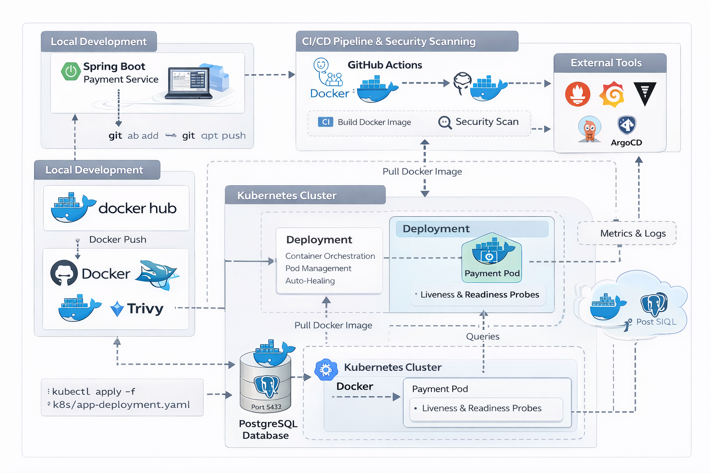

### 2.1 Core Components

#### Payment Processing API (Spring Boot)

* Handles payment creation and lifecycle management.
* Enforces controlled state transitions.
* Records audit history of all lifecycle changes.
* Exposes REST endpoints for external systems.
* Provides monitoring endpoints via Actuator.

### Database Layer

#### Local Development

* **H2 in-memory database**
* Used for fast iteration and local validation
* Enables JPA auto-configuration without external dependencies

#### Containerized & Kubernetes Environments

* **PostgreSQL**
* Provides ACID compliance
* Enforces relational integrity
* Supports production-grade persistence requirements

#### Docker

* Containerizes the Spring Boot application.
* Ensures consistent runtime environments.
* Eliminates “works on my machine” issues.

#### Docker Compose

* Orchestrates multi-container setup locally.
* Runs application and PostgreSQL together.
* Manages internal container networking.

#### Kubernetes (Kind)

* Simulates a production Kubernetes cluster locally.
* Manages deployments, services, scaling, and configuration.
* Enables infrastructure-as-code workflows.

#### CI/CD Pipeline (GitHub Actions)

* Automates build and test processes.
* Builds container images.
* Integrates vulnerability scanning.
* Simulates real DevOps pipeline workflows.

#### Monitoring Stack (Prometheus & Grafana)

* Collects application metrics.
* Visualizes operational data.
* Provides observability for performance and reliability.

### 2.2 High-Level System Flow

1. A merchant system sends a payment request to the API.
2. The API creates a payment with initial status `PENDING`.
3. The service transitions the payment to `PROCESSING`.
4. Business logic determines final status:

   * `SUCCESS` if validation passes
   * `FAILED` otherwise
5. Each transition is recorded in a history table.
6. The final payment status is returned to the caller.
7. Monitoring endpoints expose health and metrics data.

This flow demonstrates lifecycle enforcement, auditability, and clean separation of responsibilities.

## 3. Technology Stack

The platform leverages modern backend and DevOps technologies to simulate a production-grade system lifecycle.

### Backend

* **Spring Boot** – REST API development and application framework
* **Spring Data JPA** – ORM layer for relational persistence
* **H2 Database** – In-memory database for local development
* **PostgreSQL** – Production-grade relational database (Docker & Kubernetes stages)
* **Spring Boot Actuator** – Health and metrics endpoints
* **Lombok** – Boilerplate code reduction

### Containerization

* **Docker** – Application containerization
* **Docker Compose** – Multi-container orchestration for local environments

### Orchestration

* **Kubernetes (Kind)** – Local cluster simulation for deployment management

### CI/CD

* **GitHub Actions** – Automated build, test, and container workflows

### Security

* **Trivy** – Container vulnerability scanning

### Monitoring & Observability

* **Spring Boot Actuator** – Application metrics exposure
* **Prometheus** – Metrics collection
* **Grafana** – Metrics visualization

### Testing

* **JUnit** – Unit testing framework
* **Mockito** – Mocking framework for isolation testing

## 4. Repository Structure

The project is structured as a single monorepo containing application code, infrastructure configuration, and operational tooling.

```
Local-DevOps-Production-Platform/
│
├── app/                     # Spring Boot application source code
│
├── docker/                  # Docker and Docker Compose configuration
│
├── k8s/                     # Kubernetes manifests (Kind deployment)
│
├── monitoring/              # Prometheus and Grafana configuration
│
├── .github/
│   └── workflows/           # CI/CD pipelines (GitHub Actions)
│
├── docs/                    # Architecture diagrams and supporting documentation
│
└── README.md                # Project documentation
```

### Structure Philosophy

The repository structure reflects separation of concerns:

- Application logic is isolated under `app/`.
- Container and runtime configuration are separated from source code.
- Kubernetes manifests are maintained independently of application logic.
- CI/CD automation is version-controlled alongside the application.
- Monitoring configuration is modular and extensible.

## 5. Prerequisites

Before running this project, ensure the following tools are installed:

### Required Software

- Java 17 or later
- Maven 3.9+
- Docker
- Docker Compose
- Git
- kubectl (Kubernetes CLI)
- Kind (Kubernetes in Docker)

### Recommended Environment

- Ubuntu 22.04+ (or compatible Linux distribution)
- Minimum 8GB RAM for Kubernetes and monitoring stack

## 6. Application Design

This section describes the domain model, relational structure, lifecycle behavior, API surface, and architectural decisions that define the Payment Processing Simulation.

The design reflects production-grade backend principles including separation of concerns, auditability, lifecycle enforcement, and relational integrity.

### 6.1 Domain Model

The core domain entity of the platform is **Payment**.

A payment represents a financial transaction request initiated by a merchant system and processed by the payment service.

#### Payment Entity

| Field      | Type                 | Description                                       |
| ---------- | -------------------- | ------------------------------------------------- |
| id         | UUID                 | Unique identifier for the payment                 |
| amount     | BigDecimal           | Monetary value of the transaction                 |
| currency   | String               | ISO currency code (e.g., USD, EUR)                |
| reference  | String               | External merchant reference                       |
| customerId | String               | Identifier of the customer initiating the payment |
| status     | PaymentStatus (Enum) | Current lifecycle state                           |
| createdAt  | Timestamp            | Creation timestamp                                |
| updatedAt  | Timestamp            | Last modification timestamp                       |

#### PaymentStatus Enum

The payment lifecycle is controlled using a strongly typed enumeration:

* PENDING
* PROCESSING
* SUCCESS
* FAILED

Using an enum ensures lifecycle states remain constrained and predictable.

#### PaymentStatusHistory Entity

To preserve auditability and traceability, every status transition is recorded in a separate entity.

| Field     | Type          | Description                          |
| --------- | ------------- | ------------------------------------ |
| id        | UUID          | Unique identifier for history record |
| payment   | Payment       | Associated payment (Many-to-One)     |
| oldStatus | PaymentStatus | Previous lifecycle state             |
| newStatus | PaymentStatus | Updated lifecycle state              |
| changedAt | Timestamp     | Transition timestamp                 |

This structure enables a full audit trail of lifecycle transitions.

### 6.2 Database Schema

The relational schema enforces normalization and referential integrity.

#### payments Table

* id (UUID, Primary Key)
* amount (DECIMAL)
* currency (VARCHAR)
* reference (VARCHAR, UNIQUE)
* customer_id (VARCHAR)
* status (VARCHAR)
* created_at (TIMESTAMP)
* updated_at (TIMESTAMP)

#### payment_status_history Table

* id (UUID, Primary Key)
* payment_id (UUID, Foreign Key referencing payments.id)
* old_status (VARCHAR)
* new_status (VARCHAR)
* changed_at (TIMESTAMP)

#### Relationship Design

* One Payment can have many PaymentStatusHistory records.
* Foreign key constraints ensure referential integrity.
* Status transitions are stored as immutable records.
* Payment records themselves are not deleted.

### 6.3 Payment Lifecycle

The payment lifecycle represents controlled state transitions from creation to final resolution.

#### Lifecycle Flow

1. Merchant sends a payment request.
2. Payment is created with status `PENDING`.
3. Payment transitions to `PROCESSING`.
4. Business rule simulation determines outcome:

   * If amount > 0 → `SUCCESS`
   * Otherwise → `FAILED`
5. Each transition is recorded in `payment_status_history`.

#### State Transition Rules

* `PENDING` → `PROCESSING`
* `PROCESSING` → `SUCCESS`
* `PROCESSING` → `FAILED`

Invalid transitions are not permitted and are enforced in the Service layer.

### 6.4 API Contract

The payment service exposes RESTful endpoints for interaction with external systems.

The API follows standard JSON-based request and response patterns typical of production-grade backend services.

#### Create Payment

`POST /payments`

Creates a new payment and initiates lifecycle processing.

#### Request (JSON Body)

```http
POST /payments
Content-Type: application/json
```

```json
{
  "amount": 100,
  "currency": "USD",
  "reference": "ORDER-12345",
  "customerId": "CUST-001"
}
```

#### Request Fields

| Field      | Type       | Description                           |
| ---------- | ---------- | ------------------------------------- |
| amount     | BigDecimal | Transaction monetary value            |
| currency   | String     | ISO currency code                     |
| reference  | String     | Merchant-provided reference           |
| customerId | String     | Identifier of the initiating customer |

> The request payload is mapped to a dedicated DTO (`CreatePaymentRequest`) to decouple the API contract from the persistence entity.

#### Response

**200 OK**

```json
{
  "id": "UUID",
  "amount": 100,
  "currency": "USD",
  "reference": "ORDER-12345",
  "customerId": "CUST-001",
  "status": "SUCCESS",
  "createdAt": "2026-03-02T19:40:11.712588674",
  "updatedAt": "2026-03-02T19:40:11.805804354"
}
```

#### Lifecycle Behavior

Upon receiving a valid request:

1. A payment is created with status `PENDING`.
2. The payment transitions to `PROCESSING`.
3. Based on business rules, it transitions to either:

   * `SUCCESS`
   * `FAILED`
4. Each transition is recorded in `payment_status_history`.

#### Health Check

`GET /actuator/health`

Confirms application availability and monitoring readiness.


## 6.5 Design Decisions

Several architectural decisions were made to simulate production-grade system behavior.

#### UUID as Primary Key

Ensures global uniqueness and avoids predictable sequential identifiers.

#### Separate Status History Table

Maintains:

* Auditability
* Traceability
* Normalized relational design
* Clear lifecycle transparency

#### Service Layer Lifecycle Enforcement

Business rules and state transitions are enforced within the Service layer to maintain separation of concerns and prevent invalid status changes.

#### Immutable Payment Records

Payments are not deleted.
Lifecycle changes are recorded via state transitions rather than record mutation or removal.

#### Database Strategy

* H2 is used for local development validation.
* PostgreSQL is the intended production database in containerized deployment.

This ensures development flexibility while preserving production realism.

## 7. Local Development Setup

This section describes how the application is built, executed, and validated locally before introducing containerized infrastructure.

The purpose of this stage is to validate:

* Application compilation
* Dependency resolution
* JPA auto-configuration
* Entity mapping
* Repository initialization
* Service-layer lifecycle enforcement
* Database persistence
* Health monitoring endpoints

This ensures the application is functionally stable before Dockerization.

### 7.1 Initialize Spring Boot Application

The Spring Boot application was generated using Spring Initializr and placed inside the `app/` directory.

#### Project Metadata

* Group: `com.localdevops`
* Artifact: `payment-service`
* Packaging: `jar`
* Java Version: 17

#### Core Dependencies

* Spring Boot Starter Web
* Spring Boot Starter Data JPA
* H2 Database (runtime)
* Spring Boot Actuator
* Lombok
* Spring Boot Starter Test

> H2 is used for local development validation. PostgreSQL will be introduced in the Docker Compose stage to simulate a production-grade database environment.

### 7.2 H2 Local Database Configuration

To enable local persistence without requiring external infrastructure, an in-memory H2 database is configured.

#### application.properties

```properties
spring.application.name=payment-service

spring.datasource.url=jdbc:h2:mem:testdb
spring.datasource.driverClassName=org.h2.Driver
spring.datasource.username=sa
spring.datasource.password=

spring.jpa.hibernate.ddl-auto=update

spring.h2.console.enabled=true
```

#### Why H2 Is Used

* Enables automatic JPA configuration
* Allows repository beans to initialize
* Automatically generates schema from entities
* Removes dependency on external database setup
* Speeds up local development cycles

This follows incremental development principles.

#### 7.3 Build the Application

Navigate to the application directory:

```bash
cd app/payment-service
```

Build the project:

```bash
./mvnw clean install
```

This step:

* Compiles source code
* Validates entity mappings
* Ensures dependency resolution
* Produces an executable JAR

Expected output:

```
BUILD SUCCESS
```

#### 7.4 Run the Application

Start the application:

```bash
./mvnw spring-boot:run
```

Successful startup logs should include:

```
Tomcat started on port 8080
Started PaymentServiceApplication
```

This confirms:

* Embedded Tomcat initialized
* Application context loaded successfully
* JPA repositories registered
* H2 datasource configured properly


### 7.5 Actuator Health Verification

Spring Boot Actuator is enabled for runtime monitoring.

Verify application health:

```
http://localhost:8080/actuator/health
```

Expected response:

```json
{
  "status": "UP"
}
```

This confirms:

* The application is responsive
* Monitoring endpoints are active
* Application context is fully initialized


### 7.6 Payment Lifecycle Validation

To validate the service-layer business logic and lifecycle enforcement, a test payment is created using a JSON request body.

#### Create Payment (JSON Request)

```bash
curl -X POST http://localhost:8080/payments \
-H "Content-Type: application/json" \
-d '{"amount":100,"currency":"USD","reference":"ORDER-LOCAL-1","customerId":"CUST-LOCAL-1"}'
```

#### Expected Response

```json
{
  "id": "UUID",
  "amount": 100,
  "currency": "USD",
  "reference": "ORDER-LOCAL-1",
  "customerId": "CUST-LOCAL-1",
  "status": "SUCCESS",
  "createdAt": "...",
  "updatedAt": "..."
}
```

#### Lifecycle Behavior

When the request is processed:

1. A Payment entity is created with status `PENDING`
2. The service transitions the payment to `PROCESSING`
3. Based on validation rules:

   * If amount > 0 → status becomes `SUCCESS`
   * Otherwise → status becomes `FAILED`
4. Each transition is recorded in `payment_status_history`

This confirms correct service-layer lifecycle enforcement.

### 7.7 Database Verification Using H2 Console

Access the H2 console:

```
http://localhost:8080/h2-console
```

Connection details:

* JDBC URL: `jdbc:h2:mem:testdb`
* Username: `sa`
* Password: (empty)


#### Verify Payment Record

```sql
SELECT * FROM PAYMENTS;
```

#### Verify Status History

```sql
SELECT old_status, new_status, changed_at
FROM PAYMENT_STATUS_HISTORY;
```

Expected result:

* One record in `PAYMENTS`
* Two records in `PAYMENT_STATUS_HISTORY`

  * PENDING → PROCESSING
  * PROCESSING → SUCCESS


This confirms:

* One-to-many relationship integrity
* UUID primary key generation
* Proper foreign key mapping
* Service transition logic execution
* Audit trail preservation

### 7.8 Development Validation Summary

At the conclusion of local validation, the system supports:

* REST API interaction via JSON request body
* Layered architecture (Controller → Service → Repository)
* Automatic schema generation via JPA
* In-memory database persistence
* Lifecycle transition enforcement
* Audit history tracking
* Runtime health monitoring

This completes functional validation prior to containerization.

## 8. Dockerization and Containerized Database

After validating the application locally using an in-memory H2 database, the next step is to package the service into containers and introduce a production-style database environment.

This stage introduces:

- Application containerization
- PostgreSQL containerized database
- Docker networking
- Persistent database storage
- Environment-based configuration
- Multi-container orchestration using Docker Compose

This simulates how modern backend systems are deployed in production environments.

### 8.1 Application Containerization

The Spring Boot application is containerized using Docker to ensure consistent execution across different environments.

A **multi-stage build** is used to optimize the final image size.

#### Dockerfile Location

```
app/payment-service/Dockerfile
```

#### Dockerfile

```dockerfile
FROM maven:3.9.9-eclipse-temurin-17 AS builder

WORKDIR /build

COPY pom.xml .
COPY src ./src

RUN mvn clean package -DskipTests

FROM eclipse-temurin:17-jdk

WORKDIR /app

COPY --from=builder /build/target/payment-service-0.0.1-SNAPSHOT.jar app.jar

EXPOSE 8080

ENTRYPOINT ["java","-jar","app.jar"]
```

#### Why Multi-Stage Build Is Used

Multi-stage builds separate the **build environment** from the **runtime environment**.

Benefits include:

- Smaller final image size
- Improved security
- Reduced attack surface
- Faster container startup

### 8.2 Docker Compose Architecture

Docker Compose is used to orchestrate multiple containers required for the platform.

The system consists of two services:

1. **payment-service** — Spring Boot application
2. **postgres-db** — PostgreSQL database

#### docker-compose.yml Location

```
docker-compose.yml
```

#### docker-compose.yml

```yaml
version: '3.9'

services:

  postgres-db:
    image: postgres:15
    container_name: postgres-db
    environment:
      POSTGRES_DB: paymentdb
      POSTGRES_USER: postgres
      POSTGRES_PASSWORD: postgres
    ports:
      - "5432:5432"
    volumes:
      - postgres_data:/var/lib/postgresql/data
    healthcheck:
      test: ["CMD-SHELL", "pg_isready -U postgres"]
      interval: 10s
      timeout: 5s
      retries: 5

  payment-service:
    build:
      context: ./app/payment-service
    container_name: payment-service
    ports:
      - "8080:8080"
    depends_on:
      postgres-db:
        condition: service_healthy
    environment:
      DB_URL: jdbc:postgresql://postgres-db:5432/paymentdb
      DB_USERNAME: postgres
      DB_PASSWORD: postgres

volumes:
  postgres_data:
```

### 8.3 Container Networking

Docker Compose automatically creates an isolated network for all services.

This allows containers to communicate using **service names as hostnames**.

Example:

```
jdbc:postgresql://postgres-db:5432/paymentdb
```

Here:

- `postgres-db` is the service name
- Docker resolves it to the correct container IP address

This removes the need for manual network configuration.

### 8.4 Database Persistence with Volumes

PostgreSQL stores database files inside the container path:

```
/var/lib/postgresql/data
```

A Docker **named volume** is mounted to preserve this data.

```
volumes:
  postgres_data:
```

This ensures:

- Data survives container restarts
- Database state is preserved
- Application data is not lost

Without volumes, containers would lose all data when restarted.

### 8.5 Environment-Based Configuration

The application uses environment variables for database configuration.

Inside `application.properties`:

```properties
spring.datasource.url=${DB_URL}
spring.datasource.username=${DB_USERNAME}
spring.datasource.password=${DB_PASSWORD}
```

Docker Compose injects these variables at runtime.

This approach follows **12-Factor App principles** and enables:

- Environment portability
- Secure configuration management
- Separation of config from code

### 8.6 Running the Multi-Container System

From the project root directory:

```bash
docker compose up --build
```

This command will:

1. Build the Spring Boot container image
2. Start the PostgreSQL container
3. Wait for database readiness
4. Start the application container
5. Establish container networking

Successful startup logs will show:

```
Tomcat started on port 8080
Started PaymentServiceApplication
```

### 8.7 API Validation in Containerized Environment

Once containers are running, the API can be tested from the host machine.

#### Create Payment

```bash
curl -X POST http://localhost:8080/payments \
-H "Content-Type: application/json" \
-d '{"amount":200,"currency":"USD","reference":"DOCKER-1","customerId":"CUST-DOCKER"}'
```

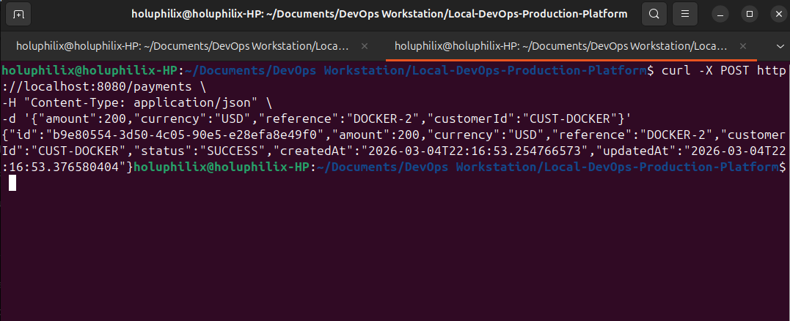

Response:

```json
{
  "id": "6bf524cc-6d9f-4153-8bc8-d1aea3b2fa20",
  "amount": 200,
  "currency": "USD",
  "reference": "DOCKER-1",
  "customerId": "CUST-DOCKER",
  "status": "SUCCESS",
  "createdAt": "...",
  "updatedAt": "..."
}
```

### 8.8 PostgreSQL Data Verification

To verify that data is stored inside PostgreSQL:

Enter the database container:

```bash
docker exec -it postgres-db psql -U postgres -d paymentdb
```

Query the payments table:

```sql
SELECT * FROM payments;
```

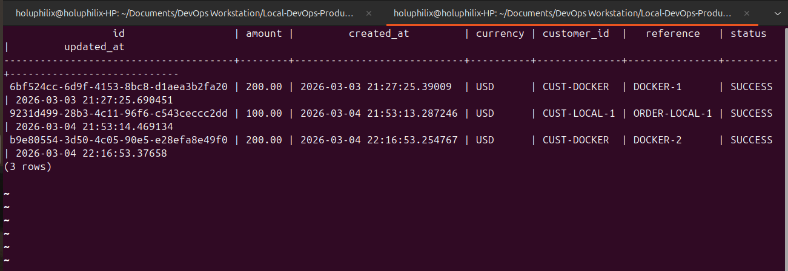


Query the status history:

```sql
SELECT * FROM payment_status_history;
```

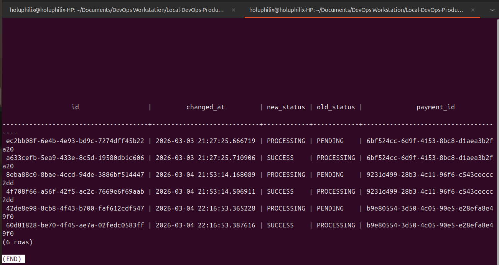

This confirms:

- PostgreSQL persistence works
- Application successfully writes to the containerized database
- Payment lifecycle history is correctly stored

### 8.9 Containerization Validation Summary

At the end of this stage, the system supports:

- Containerized Spring Boot application
- Containerized PostgreSQL database
- Docker Compose orchestration
- Service networking
- Health-based startup ordering
- Persistent database storage
- Environment-based configuration

This establishes a production-style foundation before introducing Kubernetes deployment.

## 9. Kubernetes Deployment (Kind)

After validating the application using Docker Compose, the next step is deploying the system to a Kubernetes environment.

For local Kubernetes orchestration, **Kind (Kubernetes in Docker)** is used. Kind runs a fully functional Kubernetes cluster inside Docker containers, making it suitable for development and testing.

This stage introduces:

- Kubernetes cluster creation
- Container image loading into Kind
- Kubernetes manifests for application deployment
- Service exposure inside the cluster
- Pod orchestration and lifecycle management

This simulates how applications are deployed and managed in real production Kubernetes environments.

### 9.1 Creating the Kind Cluster

A local Kubernetes cluster is created using Kind.

Command:

```bash
kind create cluster --name devops-platform
```

This command initializes a Kubernetes control-plane node running inside Docker.

**Expected output:**


Then Verify the Cluster

Run:

```bash
kubectl get nodes
```

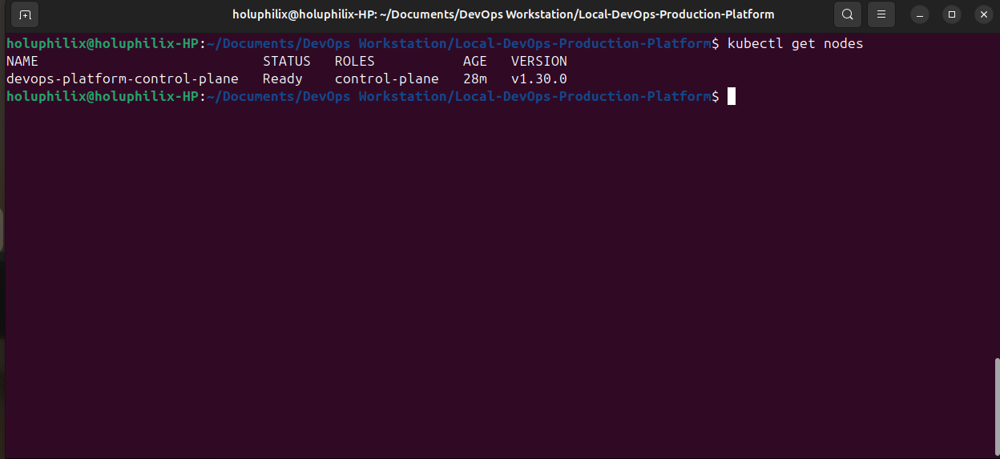

### 9.2 Building the Application Image for Kubernetes

Before deploying the application to Kubernetes, the container image must be built locally.

Navigate to the project root directory and build the image using Docker.

```bash
docker build -t payment-service:1.0 ./app/payment-service
```


This command performs the following:

- Builds the application container image using the Dockerfile
- Tags the image as `payment-service:1.0`
- Stores the image in the local Docker image registry

Verify the image was created:

```bash
docker images | grep payment-service
```

Expected output:

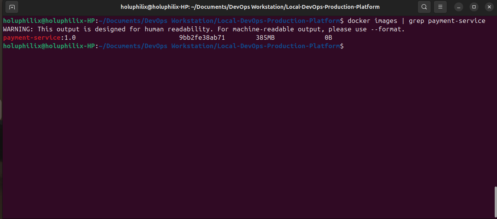

This confirms the container image is ready to be deployed.

### 9.3 Loading the Image into the Kind Cluster

Kind clusters run inside Docker containers. Because of this, Kubernetes nodes cannot directly access images stored on the host machine.

To make the application image available inside the Kind cluster, it must be manually loaded.

Command:

```bash
kind load docker-image payment-service:1.0 --name devops-platform
```

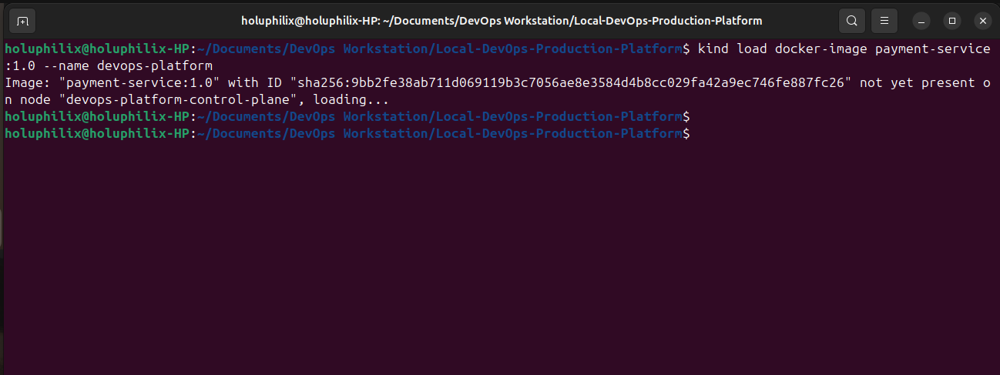

This command transfers the locally built Docker image into the Kind cluster node.

Once loaded, Kubernetes can use the image when creating Pods and Deployments.

### 9.4 Kubernetes Manifest Structure

Kubernetes resources are defined using YAML manifests.

For this project, all Kubernetes configuration files are stored inside a dedicated `k8s` directory.

From your project root:

```bash
mkdir k8s
```

Your project structure will now look like:

```
Local-DevOps-Production-Platform
│
├── app/
├── docker-compose.yml
├──k8s/
    app-deployment.yaml
    app-service.yaml
└── README.md
```

These manifests define how the application is deployed and exposed inside the Kubernetes cluster.

**Now We Create the First Manifest**

Inside the new folder:

```bash
cd k8s
```

Create the deployment file:

```bash
nano app-deployment.yaml
```

Paste this.

```yaml
apiVersion: apps/v1
kind: Deployment
metadata:
  name: payment-service
spec:
  replicas: 1
  selector:
    matchLabels:
      app: payment-service
  template:
    metadata:
      labels:
        app: payment-service
    spec:
      containers:
        - name: payment-service
          image: payment-service:1.0
          imagePullPolicy: IfNotPresent
          ports:
            - containerPort: 8080
          env:
            - name: SPRING_PROFILES_ACTIVE
              value: docker
            - name: DB_URL
              value: jdbc:postgresql://postgres:5432/paymentdb
            - name: DB_USERNAME
              value: postgres
            - name: DB_PASSWORD
              value: postgres

```

**What This Deployment Does**

This manifest tells Kubernetes:

* run **1 replica**
* start container **payment-service**
* use image **payment-service:1.0**
* expose port **8080**

Kubernetes will create a **Pod** running your container.

### 9.5 Application Deployment Manifest

To run the application inside the Kubernetes cluster, a **Deployment** resource is created.

A Deployment ensures that the desired number of application Pods are running and automatically replaces failed Pods when necessary. It also enables scaling and rolling updates in production environments.

The deployment configuration is defined in the file:

```
k8s/app-deployment.yaml
```

#### Deployment Manifest

```yaml
apiVersion: apps/v1
kind: Deployment
metadata:
  name: payment-service
spec:
  replicas: 1
  selector:
    matchLabels:
      app: payment-service
  template:
    metadata:
      labels:
        app: payment-service
    spec:
      containers:
        - name: payment-service
          image: payment-service:1.0
          imagePullPolicy: IfNotPresent
          ports:
            - containerPort: 8080
          env:
            - name: SPRING_PROFILES_ACTIVE
              value: docker
            - name: DB_URL
              value: jdbc:postgresql://postgres:5432/paymentdb
            - name: DB_USERNAME
              value: postgres
            - name: DB_PASSWORD
              value: postgres

```

#### Deployment Configuration Explanation

| Field                      | Description                                                        |
| -------------------------- | ------------------------------------------------------------------ |
| `apiVersion`               | Specifies the Kubernetes API version used for Deployment resources |
| `kind`                     | Defines the resource type as a Deployment                          |
| `metadata.name`            | Unique name for the Deployment inside the cluster                  |
| `replicas`                 | Number of application instances Kubernetes should maintain         |
| `selector.matchLabels`     | Identifies which Pods belong to this Deployment                    |
| `template.metadata.labels` | Labels assigned to Pods created by the Deployment                  |
| `containers.name`          | Logical name of the container                                      |
| `containers.image`         | Container image loaded into the Kind cluster                       |
| `containerPort`            | Port exposed by the application container                          |

The container image `payment-service:1.0` was previously loaded into the Kind cluster using the command:

```bash
kind load docker-image payment-service:1.0 --name devops-platform
```

This allows Kubernetes to start the application without pulling the image from an external container registry.

#### Deploying the Application

To create the Deployment inside the Kubernetes cluster, run:

```bash
kubectl apply -f k8s/app-deployment.yaml
```

Successful output:

```
deployment.apps/payment-service created
```

#### Verifying the Deployment

Check the running Pods:

```bash
kubectl get pods
```

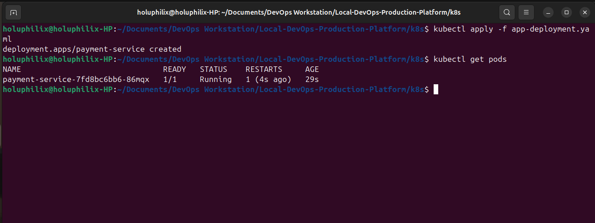

This confirms that Kubernetes successfully created a Pod running the `payment-service` container.

#### Deployment Validation

To monitor the deployment status:

```bash
kubectl get deployments
```

Expected output:


This indicates that the application deployment is healthy and running inside the Kubernetes cluster.

#### PostgreSQL Deployment

The payment service requires a PostgreSQL database for persistent storage.  
To provide this dependency inside the Kubernetes cluster, PostgreSQL is deployed as a separate Deployment resource.

Deployment file location:

```
k8s/postgres-deployment.yaml
```

#### PostgreSQL Deployment Manifest

```yaml
apiVersion: apps/v1
kind: Deployment
metadata:
  name: postgres
spec:
  replicas: 1
  selector:
    matchLabels:
      app: postgres
  template:
    metadata:
      labels:
        app: postgres
    spec:
      containers:
      - name: postgres
        image: postgres:15
        ports:
        - containerPort: 5432
        env:
        - name: POSTGRES_DB
          value: paymentdb
        - name: POSTGRES_USER
          value: postgres
        - name: POSTGRES_PASSWORD
          value: postgres
```

#### Deployment Explanation

| Field               | Description                                    |
| ------------------- | ---------------------------------------------- |
| `Deployment`        | Ensures PostgreSQL pod is always running       |
| `replicas`          | Specifies one database instance                |
| `image`             | Official PostgreSQL container image            |
| `containerPort`     | Database port exposed inside the cluster       |
| `POSTGRES_DB`       | Database name automatically created at startup |
| `POSTGRES_USER`     | Database username                              |
| `POSTGRES_PASSWORD` | Database password                              |

#### Deploy PostgreSQL Database

Deploy the PostgreSQL database to the Kubernetes cluster:

```bash
kubectl get deployments
```

Verify the deployment:

```bash
kubectl get pods
```

This confirms that the **PostgreSQL database** is running inside the Kubernetes cluster.

### 9.6 PostgreSQL Service

To allow other pods to communicate with PostgreSQL, create a Kubernetes **Service**.

Service file location:

```bash
k8s/postgres-service.yaml
```

#### PostgreSQL Service Manifest

```yaml
apiVersion: v1
kind: Service
metadata:
  name: postgres
spec:
  selector:
    app: postgres
  ports:
    - port: 5432
      targetPort: 5432
```
#### Why This Service Is Required

Kubernetes services provide **stable networking endpoints** for pods.

The service name **postgres** becomes an internal DNS entry inside the cluster.

Applications connect to the database using:

```bash
postgres:5432
```

Database connection string:

```bash
jdbc:postgresql://postgres:5432/paymentdb
```

Deploy the service:

```bash
kubectl apply -f k8s/postgres-service.yaml
```

### 9.7 Kubernetes Architecture

```
Kubernetes Cluster
│
├── postgres (Deployment + Service)
│
└── payment-service (Deployment)
```

Pods communicate internally using:

```
postgres:5432
```

#### Verification

Check that both pods are running:

```bash
kubectl get pods
```

Expected output:

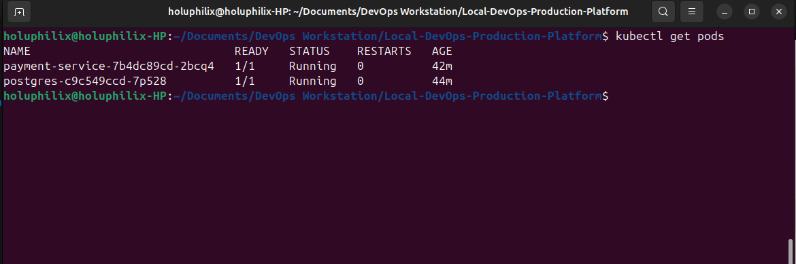

### 9.8 Application Service (Expose API)

Kubernetes Pods are not directly accessible from outside the cluster.  
To expose the application, a **Service** resource is created.

The service acts as a stable network endpoint that forwards external traffic to the application Pods.

Service file location:

```
k8s/app-service.yaml
```

#### Application Service Manifest

```yaml
apiVersion: v1
kind: Service
metadata:
  name: payment-service
spec:
  type: NodePort
  selector:
    app: payment-service
  ports:
  - port: 8080
    targetPort: 8080
    nodePort: 30007
```

#### Service Configuration Explanation

| Field | Description |
|------|-------------|
| `type: NodePort` | Exposes the service outside the cluster |
| `selector` | Routes traffic to Pods labeled `payment-service` |
| `port` | Service port inside the cluster |
| `targetPort` | Container port inside the Pod |
| `nodePort` | External port used to access the application |

#### Deploy the Service

Create the service with:

```bash
kubectl apply -f k8s/app-service.yaml
```

Expected output:

```
service/payment-service created
```

#### Verify the Service

Run:

```bash
kubectl get services
```

Output:

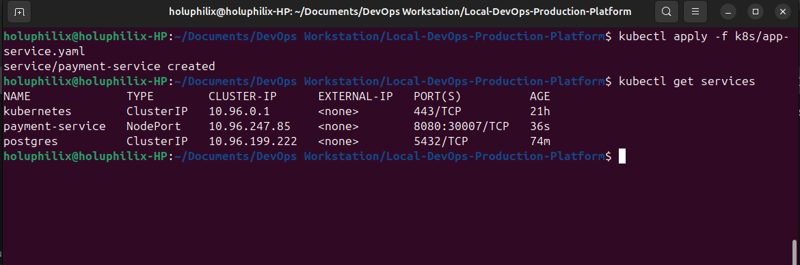

### 9.9 Accessing the Application

For Kind-based Kubernetes clusters, NodePort services are not directly exposed on the host machine because the Kubernetes node itself runs inside a Docker container.

To access the application from the local machine, **port forwarding** is used. This forwards traffic from the host to the Kubernetes Service inside the cluster.

Run the following command:

```bash
kubectl port-forward service/payment-service 8080:8080
```

Expected output:

```
Forwarding from 127.0.0.1:8080 -> 8080
Forwarding from [::1]:8080 -> 8080
```

Once the port forwarding session is active, the application becomes accessible locally at:

```
http://localhost:8080
```

### 9.10 API Validation

After exposing the service, the API can be tested to verify that the Kubernetes deployment is functioning correctly.

Run the following request:

```bash
curl -X POST http://localhost:8080/payments \
-H "Content-Type: application/json" \
-d '{"amount":500,"currency":"USD","reference":"K8S-TEST-2","customerId":"CUST-K8S"}'
```

Response:

```json
{
  "id": "UUID",
  "amount": 500,
  "currency": "USD",
  "reference": "K8S-TEST-2",
  "customerId": "CUST-K8S",
  "status": "SUCCESS"
}
```

This confirms that:

* The Kubernetes **Service is correctly routing traffic to the application Pod**
* The **Spring Boot API is operational inside the cluster**
* The application successfully **communicates with the PostgreSQL database**
* The full request lifecycle executes correctly within the Kubernetes environment

This completes the validation of the application deployment inside the Kind-based Kubernetes cluster.

## 9.11 Kubernetes Architecture Overview

The application is deployed inside a Kubernetes cluster created using **Kind (Kubernetes in Docker)**.
The architecture consists of multiple Kubernetes resources working together to run and expose the payment service.

### System Architecture

```
Client
   │
   │  HTTP Request
   ▼
kubectl port-forward
   │
   ▼
Kubernetes Service (payment-service)
   │
   ▼
Payment-Service Pod
(Spring Boot Application)
   │
   │ JDBC Connection
   ▼
Kubernetes Service (postgres)
   │
   ▼
PostgreSQL Pod
(Database)
```

### Component Breakdown

| Component                        | Description                                                                |
| -------------------------------- | -------------------------------------------------------------------------- |
| **Kind Cluster**                 | Local Kubernetes cluster running inside Docker                             |
| **Deployment (payment-service)** | Manages the lifecycle of the Spring Boot application Pod                   |
| **Service (payment-service)**    | Exposes the application inside the cluster and allows port-forward access  |
| **Deployment (postgres)**        | Runs the PostgreSQL database container                                     |
| **Service (postgres)**           | Provides a stable DNS endpoint (`postgres:5432`) for database connectivity |
| **Pod Networking**               | Enables internal communication between application and database Pods       |

### Internal Service Communication

Kubernetes services provide **built-in DNS resolution**, allowing the application to connect to PostgreSQL using the service name:

```
jdbc:postgresql://postgres:5432/paymentdb
```

This eliminates the need for fixed IP addresses and enables dynamic service discovery within the cluster.

#### Deployment Outcome

At the end of this stage, the platform successfully demonstrates:

* Containerized application deployment
* Kubernetes Pod orchestration
* Internal service networking
* Stateful database connectivity
* Local cluster exposure using port-forwarding

This completes the Kubernetes deployment stage of the project and prepares the platform for **CI/CD automation and production-grade DevOps workflows**.
Sir, your section is already strong. I’ve refined it to sound **more professional, clearer, and more consistent with high-quality GitHub README standards** while keeping everything easy to paste directly into your file.

## 10. CI/CD Pipeline

To automate the build and containerization process, a **Continuous Integration and Continuous Deployment (CI/CD)** pipeline is implemented using **GitHub Actions**.

The pipeline is automatically triggered whenever code is pushed to the `main` branch. This ensures that every change to the codebase is validated, built, and packaged consistently without manual intervention.

### Pipeline Stages

The pipeline performs the following stages:

* Source code checkout
* Java environment setup
* Application build using Maven
* Docker image build
* Docker image push to Docker Hub

### Pipeline Configuration

The workflow configuration file is located at:

```
.github/workflows/ci-cd-pipeline.yml
```

### GitHub Actions Workflow

```yaml
name: CI/CD Pipeline

on:
  push:
    branches:
      - main

jobs:

  build:
    runs-on: ubuntu-latest

    steps:

      - name: Checkout repository
        uses: actions/checkout@v4

      - name: Set up Java
        uses: actions/setup-java@v4
        with:
          distribution: temurin
          java-version: '17'

      - name: Build application
        run: |
          cd app/payment-service
          mvn clean package -DskipTests

      - name: Log in to Docker Hub
        uses: docker/login-action@v3
        with:
          username: ${{ secrets.DOCKER_HUB_USERNAME }}
          password: ${{ secrets.DOCKER_HUB_TOKEN }}

      - name: Build Docker image
        run: |
          docker build -t ${{ secrets.DOCKER_HUB_USERNAME }}/payment-service:${{ github.sha }} ./app/payment-service

      - name: Push Docker image
        run: |
          docker push ${{ secrets.DOCKER_HUB_USERNAME }}/payment-service:${{ github.sha }}
```

### CI/CD Pipeline Execution

The following screenshot shows a successful CI/CD pipeline run in GitHub Actions.

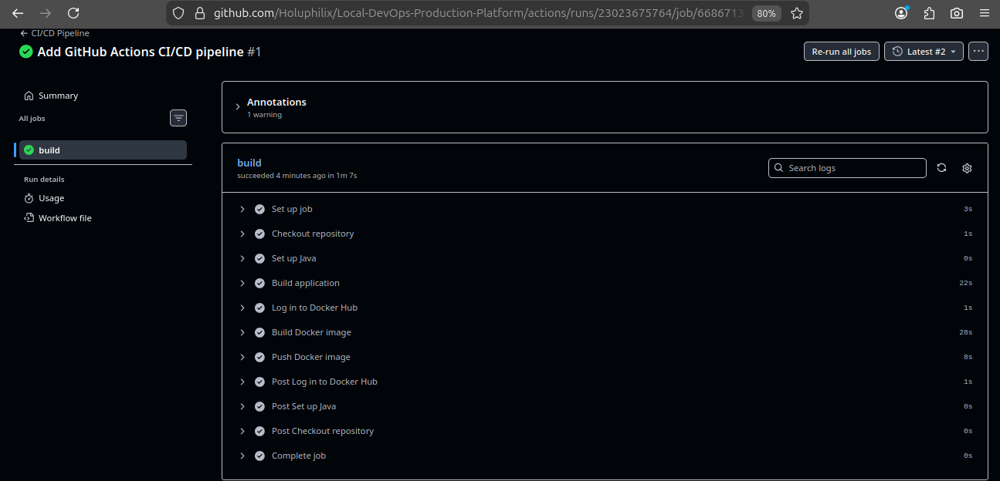

### 10.1 Pipeline Workflow

When code is pushed to the `main` branch, the pipeline automatically executes the following steps.

#### Source Checkout

The pipeline retrieves the latest version of the source code from the GitHub repository using the `actions/checkout` action.

#### Java Environment Setup

Java 17 is installed using `actions/setup-java` to ensure compatibility with the **Spring Boot** application.

#### Application Build

The application is compiled and packaged using **Maven**:

```bash
mvn clean package -DskipTests
```

This process generates the executable **Spring Boot JAR** file required to run the application.

#### Docker Image Build

A Docker image containing the packaged application is built using the project's `Dockerfile`.

#### Docker Image Push

After the image is successfully built, it is pushed to **Docker Hub**, making it available for deployment in containerized environments.

This process ensures that the latest version of the application is always stored in the container registry and ready for deployment.

### 10.2 Image Versioning Strategy

To improve traceability and support reliable deployments, Docker images can be tagged using the **Git commit SHA** generated during the pipeline execution.

Example image tag:

```
payment-service:4bfa1c3
```

#### Benefits of This Strategy

* Each build produces a **uniquely identifiable image**
* Enables **easy rollback** to previous versions
* Ensures **reproducible deployments**
* Improves **traceability between source code commits and container images**

## 11. Security Scanning

To enhance security within the CI/CD pipeline, container vulnerability scanning is integrated using **Trivy**.

Trivy scans the Docker image for known vulnerabilities before the image is pushed to the container registry.

### Vulnerability Scan Scope

The scan checks for:

- Operating system vulnerabilities
- Application dependency vulnerabilities
- Known CVEs in container images

### Pipeline Integration

During the CI/CD pipeline execution, Trivy analyzes the built Docker image:

```
docker image → vulnerability scan → push to registry
```

The scan focuses on high-risk vulnerabilities:

- CRITICAL
- HIGH

This ensures potential security risks are detected early in the development lifecycle.

### 11.1 Update the Pipeline

Open your workflow file:

```bash
nano .github/workflows/ci-cd-pipeline.yml
```

Add the **Trivy scan step** after the Docker image build.

```yaml
name: CI/CD Pipeline

on:
  push:
    branches:
      - main

jobs:

  build:
    runs-on: ubuntu-latest

    steps:

      - name: Checkout repository
        uses: actions/checkout@v4

      - name: Set up Java
        uses: actions/setup-java@v4
        with:
          distribution: 'temurin'
          java-version: '17'

      - name: Build application
        run: |
          cd app/payment-service
          mvn clean package -DskipTests

      - name: Log in to Docker Hub
        uses: docker/login-action@v3
        with:
          username: ${{ secrets.DOCKER_HUB_USERNAME }}
          password: ${{ secrets.DOCKER_HUB_TOKEN }}

      - name: Build Docker image
        run: |
          docker build -t ${{ secrets.DOCKER_HUB_USERNAME }}/payment-service:${{ github.sha }} ./app/payment-service

      - name: Run Trivy vulnerability scanner
        uses: aquasecurity/trivy-action@0.20.0
        with:
          image-ref: ${{ secrets.DOCKER_HUB_USERNAME }}/payment-service:${{ github.sha }}
          format: table
          exit-code: 0
          ignore-unfixed: true
          vuln-type: 'os,library'
          severity: 'CRITICAL,HIGH'

      - name: Push Docker image
        run: |
          docker push ${{ secrets.DOCKER_HUB_USERNAME }}/payment-service:${{ github.sha }}
```
### 11.2 Commit the Security Update

Run:

```bash
git add .
git commit -m "Add Trivy container vulnerability scanning to CI pipeline"
git push
```
### Benefits

- Improves container security posture
- Detects vulnerabilities before deployment
- Aligns with DevSecOps practices
- Helps maintain secure software supply chains

## 12. Monitoring & Observability

To ensure the reliability and health of the application in a Kubernetes environment, monitoring and observability mechanisms are integrated using **Spring Boot Actuator** and **Kubernetes health probes**.

These mechanisms allow Kubernetes to automatically detect unhealthy containers and take corrective actions such as restarting pods or temporarily removing them from service routing.

### 12.1 Spring Boot Actuator Health Endpoints

Spring Boot Actuator exposes operational endpoints that provide insights into the application’s health and runtime status.

Key endpoints include:

```
/actuator/health
/actuator/health/liveness
/actuator/health/readiness
```

Example health check:

```bash
curl http://localhost:8080/actuator/health
```

Response:

```json
{
  "status": "UP",
  "groups": [
    "liveness",
    "readiness"
  ]
}
```

These endpoints enable external systems such as Kubernetes to verify whether the application is running correctly.

### 12.2 Kubernetes Liveness Probe

The **liveness probe** checks whether the application process is still running.

If the probe fails, Kubernetes automatically **restarts the container** to recover from failure conditions.

Example scenarios where liveness probes help:

* Application deadlocks
* Infinite loops
* Runtime crashes

Configuration used in the deployment manifest:

```yaml
livenessProbe:
  httpGet:
    path: /actuator/health/liveness
    port: 8080
  initialDelaySeconds: 60
  periodSeconds: 10
```

### 12.3 Kubernetes Readiness Probe

The **readiness probe** determines whether the application is ready to serve incoming traffic.

If the readiness probe fails, Kubernetes removes the pod from the service load balancer until the application becomes healthy again.

Common situations include:

* Application startup in progress
* Database connection unavailable
* Dependency services not ready

Configuration:

```yaml
readinessProbe:
  httpGet:
    path: /actuator/health/readiness
    port: 8080
  initialDelaySeconds: 60
  periodSeconds: 5
```

### 12.4 Resource Management

To ensure efficient cluster resource usage, CPU and memory requests and limits are defined for the application container.

Resource configuration:

```yaml
resources:
  requests:
    memory: "256Mi"
    cpu: "200m"
  limits:
    memory: "512Mi"
    cpu: "500m"
```

Resource requests guarantee that Kubernetes reserves the required resources for the container, while limits prevent the container from consuming excessive resources that could affect other workloads in the cluster.

### 12.5 Observability Benefits

The monitoring and observability configuration provides several advantages:

* Automatic container recovery
* Improved system stability
* Controlled resource consumption
* Early detection of application failures
* Reliable service availability in Kubernetes

These mechanisms help maintain application resilience in production environments.

## 13. Future Improvements

While the platform demonstrates a full DevOps workflow—from application development to containerization, Kubernetes orchestration, CI/CD automation, and security scanning—several enhancements could further improve the system for production-scale environments.

### 13.1 Automated Kubernetes Deployment

Currently, the CI/CD pipeline builds and pushes container images to Docker Hub. Future improvements could include automatic deployment to Kubernetes clusters using tools such as:

- Helm
- ArgoCD
- FluxCD

These tools enable GitOps workflows, where infrastructure changes are automatically applied from version-controlled repositories.

### 13.2 Container Image Version Management

Although the pipeline currently uses commit SHA tagging, future improvements could include advanced image management strategies such as:

- semantic versioning
- automated rollback mechanisms
- deployment promotion between environments (dev, staging, production)

This would enhance traceability and deployment reliability.

### 13.3 Observability Stack Integration

Monitoring can be extended by integrating a full observability stack such as:

- Prometheus (metrics collection)
- Grafana (visual dashboards)
- Loki (centralized logging)

This would allow deeper visibility into application performance and system behavior.

### 13.4 Infrastructure as Code

The infrastructure components could be provisioned using Infrastructure as Code tools such as:

- Terraform
- AWS CloudFormation

This would allow automated provisioning of cloud resources, ensuring reproducible infrastructure environments.

### 13.5 Multi-Environment Deployment

Future iterations could introduce multiple deployment environments, including:

- Development
- Staging
- Production

Each environment could be managed through separate Kubernetes namespaces or clusters to ensure safer release processes.

### 13.6 Security Enhancements

Additional DevSecOps practices could be introduced, including:

- container image signing
- secret management using tools such as HashiCorp Vault
- runtime security monitoring

These measures would strengthen the security posture of the platform.

### Summary

These improvements would transform the platform into a fully production-ready DevOps ecosystem capable of supporting scalable and secure application deployments.
